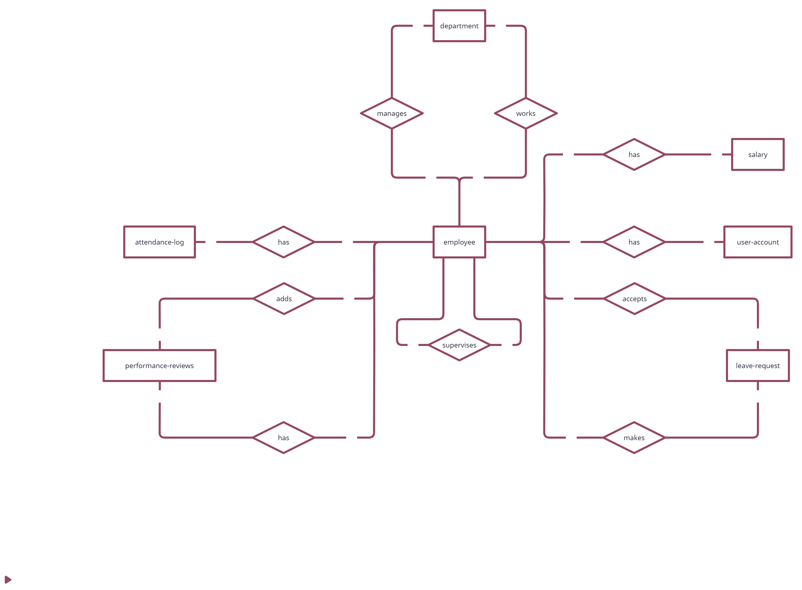

# Design Document

By ***Ziad Mohammad***

Video overview: [<URL HERE>](https://youtu.be/aJkwzxHqD1g)

## Scope

#### Purpose:

The database is designed to manage employee-related information for an organization. It facilitates efficient storage, retrieval, and manipulation of data related to employees, departments, attendance, leave requests, salaries, performance reviews, user accounts, and audit logs.

#### Inside scope:

- Employees (names, jobs, departments, contact info, performance)
- Department locations (mentioned in the data)
- Salaries, bonuses, leave requests, performance reviews, attendance records
- Attendance tracking, leave management, performance reviews, basic departments, user roles

#### Outside scope:

- Clients, contractors, anyone outside the organization
- Specific employee addresses or locations unrelated to work
- Project details, tasks, complex financial data
- Anything not directly related to employee management

## Functional Requirements

The specific user capabilities will depend on their role and access level. However, here's a general breakdown of what different types of users might be able to do:

#### Employees:

View their attendance records, clock in and out, request leave, view their performance reviews, view their salary details (potentially with restrictions), update their contact information (depending on configuration).

#### Supervisors:

View reports on employee attendance, approve or deny leave requests, conduct performance reviews for their team, view team member salary details (potentially with restrictions), communicate with team members.

#### Managers:

Access all employee data (potentially with granular access control), manage departments and roles, configure system settings, generate comprehensive reports, analyze trends, make data-driven decisions.

#### Administrative Users:

Manage user accounts and access control, maintain system security, perform backups and data recovery, troubleshoot technical issues.

## Representation

Entities are captured in SQLite tables with the following schema.

### Entities

The database includes the following entities:

#### Employees:

- `id` (INT): Unique identifier for each employee.
Constraint: `PRIMARY KEY`.
- `name` (TEXT): Name of the employee.
Constraint: `NOT NULL`.
- `date_of_birth` (DATE): Birth date of the employee.
Constraint: `NOT NULL`.
- `job_title` (TEXT): Job title of the employee.
Constraint: `NOT NULL`.
- `sup_id` (INT): Supervisor's ID for the employee.
Constraint: `Foreign key` referencing the `id` column in the `employees` table.
- `dept_id` (INT): Department ID to which the employee belongs.
Constraint: `Foreign key` referencing the `id` column in the `departments` table.

#### Employee Contacts:

- `emp_id` (INT): Employee ID for which contact information is stored.
Constraint: `Foreign key` referencing the `id` column in the `employees` table.
- `contact_info` (TEXT): Contact information (e.g., email, phone number) for the employee.
Constraint: `NOT NULL`.
- `type` (TEXT): Type of contact information (`email` or `phone`).
Constraint: `CHECK` constraint to allow only '`email`' or '`phone`' values.

#### Departments:

- `id` (INT): Unique identifier for each department.
Constraint: `PRIMARY KEY`.
- `name` (TEXT): Name of the department.
Constraint: `NOT NULL`.
- `location` (TEXT): Location of the department.
Constraint: `NOT NULL`.
- `sup_id` (INT): Supervisor's ID for the department.
Constraint: `Foreign key` referencing the `id` column in the `employees` table.

#### Attendance Log:

- `id` (INT): Unique identifier for each attendance record.
Constraint: `PRIMARY KEY`.
- `emp_id` (INT): Employee ID for which attendance is recorded.
Constraint: `Foreign key` referencing the `id` column in the `employees` table.
- `date` (DATE): Date of attendance.
Constraint: `NOT NULL`.
- `clock_in` (DATETIME): Time when the employee clocked in.
Constraint: `NOT NULL`.
- `clock_out` (DATETIME): Time when the employee clocked out.
Constraint: `NOT NULL`.
- `notes` (TEXT): Additional notes related to the attendance record.

#### Leave Requests:

- `id` (INT): Unique identifier for each leave request.
Constraint: `PRIMARY KEY`.
- `emp_id` (INT): Employee ID who requested leave.
Constraint: `Foreign key` referencing the `id` column in the `employees` table.
- `type` (TEXT): Type of leave requested.
Constraint: `NOT NULL`.
- `start_date` (DATE): Start date of the leave.
Constraint: `NOT NULL`.
- `end_date` (DATE): End date of the leave.
Constraint: `NOT NULL`.
- `status` (TEXT): Status of the leave request (`approved`, `rejected`, `pending`).
Constraint: `CHECK` constraint to allow only specified values.
- `sup_id` (INT): Supervisor's ID who approved/rejected the leave request.
Constraint: `Foreign key` referencing the `id` column in the `employees` table.

#### Salaries:

- `id` (INT): Unique identifier for each salary record.
Constraint: `PRIMARY KEY`.
- `emp_id` (INT): Employee ID for which salary is recorded.
Constraint: `Foreign key` referencing the `id` column in the `employees` table.
- `salary` (INT): Base salary of the employee.
Constraint: Salary should be a `positive integer`.
- `bonus` (INT): Bonus amount for the employee.
Constraint: Bonus should be a `non-negative integer`.
- `deduction` (INT): Deduction amount for the employee.
Constraint: Deduction should be a `non-negative integer`.
- `payment_date` (DATE): Date when the salary was paid.
Constraint: `NOT NULL`.

#### Performance Reviews:

- `id` (INT): Unique identifier for each performance review.
Constraint: PRIMARY KEY.
- `emp_id` (INT): Employee ID for whom the performance review is conducted.
Constraint: `Foreign key` referencing the `id` column in the `employees` table.
- `rating` (INT): Performance rating given to the employee.
Constraint: Rating should be between `0` and `10`.
- `feedback` (TEXT): Feedback provided during the performance review.
- `goals` (TEXT): Goals set for the employee for improvement.
- `sup_id` (INT): Supervisor's ID who conducted the performance review.
Constraint: `Foreign key` referencing the `id` column in the `employees` table.

#### User Accounts:

- `id` (INT): Unique identifier for each user account.
Constraint: `PRIMARY KEY`.
- `emp_id` (INT): Employee ID associated with the user account.
Constraint: `Foreign key` referencing the `id` column in the `employees` table.
- `username` (TEXT): Username for the user account.
Constraint: `NOT NULL`, `UNIQUE`.
- `password` (TEXT): Password for the user account.
Constraint: `NOT NULL`.
- `role` (TEXT): Role assigned to the user account (`employee`, `manager`, `admin`).
Constraint: `CHECK` constraint to allow only specified values.

#### User Accounts Log:

- `id` (INT): Unique identifier for each log entry.
Constraint: `PRIMARY KEY`.
- `action` (TEXT): Type of action performed (`insert`, `update`, `delete`).
- `old_username` (TEXT): Old username before the action.
- `new_username` (TEXT): New username after the action.
- `old_password` (TEXT): Old password before the action.
- `new_password` (TEXT): New password after the action.

### Relationships

The below entity relationship diagram describes the relationships among the entities in the database.

#### As detailed by the diagram:

- One employee can manage one department as a manger or supervisor, also many employees work in one department.
- One employee has many rows in attendance log as he clocks in and out everyday.
- One employee may add many performance reviews if he is a supervisor or manager, while he will have many reviews if he is just an employee.
- One employee supervises many employees if he is a supervisor.
- One employee may have many salaries as the latter is updated frequently.
- One employee must have one user account.
- one employee may accept/reject a leave request if he is supervisor, while he can make many leave requests as an employee.

## Optimizations

#### Views:

Views such as `emp_dept_jobtitle`, `dept_sup`, `emp_attendance`, and `emp_salary` are created to simplify common queries by joining relevant tables and selecting specific columns. This reduces the complexity of queries and improves readability.

#### Indexes:

Indexes like `emp_name_search`, `emp_id_search`, `emp_dept_search`, `salary_emp_id_search`, `idx_leave_requests_emp_date`, and `idx_performance_reviews_emp_sup` are added to speed up common search operations. Indexes help in quickly locating rows based on specified columns, thereby improving query performance.

#### Triggers:

Triggers such as `enforce_salary_constraint`, `users_accounts_updates`, `users_accounts_deletes`, and `users_accounts_inserts` are implemented to protect data integrity and maintain an audit trail of changes.
- `enforce_salary_constraint` ensures that the salary cannot be negative when inserting a new record into the salaries table.
- `users_accounts_updates`, `users_accounts_deletes`, and `users_accounts_inserts` trigger actions to log changes made to user accounts in the users_accounts_log table.

These optimizations contribute to the overall efficiency, reliability, and security of the database system. Views simplify querying complex relationships, indexes improve query performance, and triggers enforce data integrity and provide auditability for critical operations.

## Limitations

- Lacks project or task management features.
- Payroll calculations might require additional tables or integration with external systems.
- User interface and functionalities are not included in the database schema.
